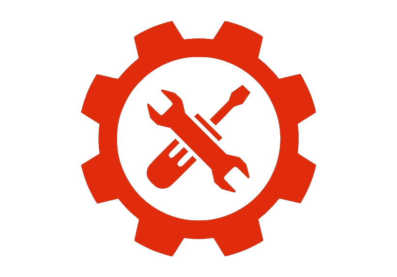

# ziggy

 

    

## Motivation

 

<i>"What I cannot create, I do not understand."</i>

The above quote from Richard P. Feynman says it all. This repo is a place to create and understand while learning things. 

More precisely it is mostly about to re-create various example and tutorial stuff. Content will come and go all the time.
 

<b>🚧 ziggy is under constant construction - a hardhat 👷 is recommended beyond this point 🚧</b>

